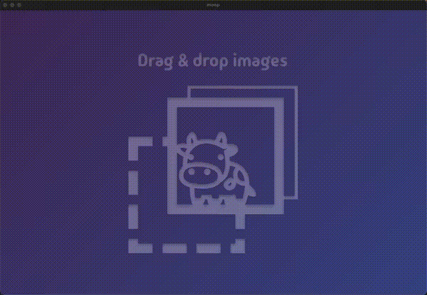

<h1 align="center">moop</h1>
<p align="center">
    
</p>
<p align="center">A desktop app for batch image optimization.</p>
<p align="center">
    <a href="https://github.com/zrubinrattet/moop/actions/workflows/tests.yml"></a>
    <a href="https://github.com/zrubinrattet/moop/actions/workflows/release.yml"></a>
</p>

<p align="center">
    
</p>


## Install

[Download the latest release for macOS](https://github.com/zrubinrattet/moop/releases)

If you get an error about the application can't be opened it's because the app is not codesigned/validated by the Apple App Store.

You can safely open and run the app after running this in Terminal:

```xattr -cr /Applications/moop.app ```

## What It Does

* Drag/drop local images
* Batch processing with quality/effort and output format controls
* Output management in app-specific input/output folders
* Max width/height support
* Multi-language UI support
* Animated image input support (webp, apng & gif)
* Animated image output support (webp, apng & avif)

## Supported File Types


- Input: `jpeg/jpg`,  `png`,  `webp`,  `tiff/tif`,  `gif`,  `svg/svgz`,  `avif`, `animated png`, `animated webp`, `animated gif`
- Output: `webp`,  `png`,  `jpeg`, `avif`, `animated webp`, `animated png`, `animated avif`
- Animated avif for input is not supported
- GIF output is not supported
- There is a pixel limit for input files of 268,402,689 pixels (calculated as 16,383 × 16,383)

| Input format | WebP output | JPEG output | PNG/APNG output | AVIF output |
|---|---:|---:|---:|---:|
| JPEG | Supported | Supported | Supported | Supported |
| PNG | Supported | Supported | Supported | Supported |
| WebP | Supported | Supported | Supported | Supported |
| AVIF, still | Supported | Supported | Supported | Supported |
| GIF, still | Supported | Supported | Supported | Supported |
| APNG | Supported as animated WebP | Supported as still JPEG | Supported as animated APNG | Supported as animated AVIF |
| Animated WebP | Supported as animated WebP | Supported as still JPEG | Supported as animated APNG | Supported as animated AVIF |
| Animated GIF | Supported as animated WebP | Supported as still JPEG | Supported as animated APNG | Supported as animated AVIF |


## Available Languages

English, Chinese, Hindi, Spanish, Arabic, French, Bengali, Portuguese, Indonesian, Urdu, Russian, German, Japanese, Marathi, Vietnamese, Telugu, Swahili, Hausa, Turkish, Punjabi, Filipino, Tamil, Persian, Korean, Amharic, Thai, Javanese, Italian, Gujarati, Kannada, Yoruba, Bhojpuri, Malayalam.

## Developer

### Architecture

* `src/bun`: runtime process, RPC handlers, routes, processing queue, menus
* `src/mainview`: React UI
* `src/shared`: shared by runtime and UI
* `src/bun/shared`: runtime-only shared helpers
* `src/mainview/shared`: UI-only shared helpers
* `src/lang`: localization dictionaries and locale helpers

### Getting Started

Install bun: [https://bun.com/docs/installation](https://bun.com/docs/installation)

Once installed, then run to install the build system and spin up the dev build with the watch flag:

```bash
bun install
bun run dev
bun run scss
```

### Build

```bash
bun run build:dev
bun run build:canary
bun run build:stable
```

### Tests

```bash
bun test
```

Run targeted suites:

```bash
bun test tests/utility
bun test tests/rpc
bun test tests/routes
```
